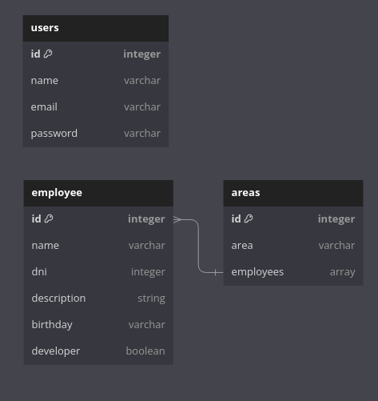

# Gotam-Back

## Introduction

Welcome to the "Gotam-Back" project documentation. In this guide, we will provide detailed information about the Gotam-backend system, an administration app service. The purpose of this documentation is to provide a comprehensive overview of the project's backend architecture, design, and operation.

## Architecture and Design

### Backend

The backend system is designed using a microservices-based architecture. Microservices communicate with each other through RESTful APIs, facilitating the scalability and maintenance of the system.

### Design Patterns

-   **MVC Pattern(Model-View-Controller):** This pattern is used to separate business logic (Model), presentation (View), and logic control (Controller), which improves the maintainability and scalability of the code.

-   **Repository Parttern:** It is used to abstract access to the database and facilitate data management in the system.

### Used Frameworks and Technologies

In the development of the Gotam-backend, the following frameworks and technologies were used:

-   Node.js: As the runtime environment for the backend due to its ability to handle asynchronous operations and scalability.
-   Express.js: A web application framework from Node.js that simplifies the creation of RESTful APIs and route handling.
-   MongoDB: As a NoSQL database to store data related to areas, users, and employees.

## Installation

### Step-by-step Instructions

To install and set up the Gotam-Backend backend in your development environment, follow these steps:

1. Clone the Repository:

git clone https://github.com/MolinaG96/gotam-back

2. Install the Dependencies:

cd gotam-back
npm install

3. Configure Environment Variables:

Create a .env file in the root directory of the project and define the necessary environment variables, such as the database connection and the secret key for JWT.

example:
BASE_URL=http://localhost:8080/
DB=Gotam
DB_HOSTNAME=
DB_PASSWORD=
DB_USERNAME=
MONGO_URI=
PORT=8080
SECRET="envsecretcode"

4. Start the Server:

### Required Dependencies and Versions

Make sure to have Node.js and npm installed on your system before proceeding with the installation.

### Libraries

-   Mongoose: An object modeling library for Node.js that facilitates interaction with the MongoDB database.
-   JWT (JSON Web Tokens): Library for user and service authentication and authorization on the platform.
-   Bcrypt: Library for encrypting user passwords.
-   Dotenv: Library for managing environment variables in the system.
-   Cors: Library for managing CORS in the system.
-   express: crucial for building RESTful APIs and web applications.

## Project Structure

Here is a high-level overview of the project structure, and a brief explanation of what each file and folder is responsible for:

```
FAST-DELIVERY-BACK
|
|-- config
| |-- db # Contains configuration for MongoDB connection.
| |-- token # JWT token configuration and utility functions.
|
|-- controllers # Holds the business logic of the application. Controllers interact with models to retrieve data and serve it to the client.
|
|-- interfaces # Holds the interfaces used across the application.
|
|-- middlewares # Holds middleware functions used across the application. This includes authentication, authorization, and error handling middleware.
|
|-- models # Contains all data models used in the application. Each model represents a collection in the MongoDB database.
|
|-- routes # Defines the API endpoints of the application. Routes are linked to controllers which handle the business logic.
|
|-- services # Contains service modules used by controllers to handle business logic. These services can include functions for fetching, updating, or deleting data, and more.
|
|-- .dockerignore # Lists files/directories that Docker should not copy into the container.
|
|-- .env # Contains environment variables. Important: This file should not be checked into version control.
|
|-- .gitignore # Specifies files that Git should ignore.
|
|-- dockerfile # Contains Docker instructions for building a Docker image for the application.
|
|-- index.ts # The main entry point of the application. This file bootstraps the Express application.
|
|-- package-lock.json # Contains the exact version of installed npm dependencies in order to reproduce an identical dependency tree.
|
|-- package.json # Lists the package dependencies for the project. Also includes metadata about the project such as name, description and version.
|
|-- README.md # Provides an overview and documentation for the project.
|
|-- tsconfig.json # Contains the configurations and options for the TypeScript compiler.
```

## models



## Routes

**The operation of the routes is documented with swagger. Run the server and go to the path http://localhost:3000/api-docs**

### Links:

## docker

-   [image in docker hub](https://hub.docker.com/repository/docker/molinagonzalo96/gotam-backend/general)

-   **or you can directly do a pull with this code:**
    **docker pull molinagonzalo96/gotam-backend:latest**

## vercel

-   [deploy on vercel](https://gotam-front.vercel.app/)

**Thank you for coming this far, I hope you like the application.**
**If you want to contact me you can do so by this email: molinagomezgonzalo@gmail.com**
